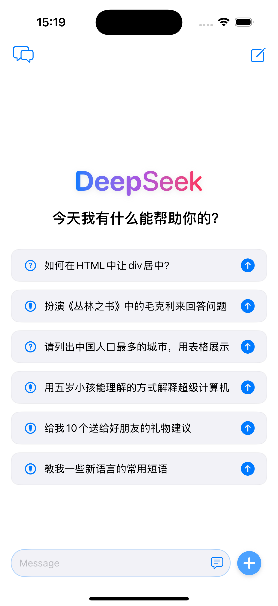
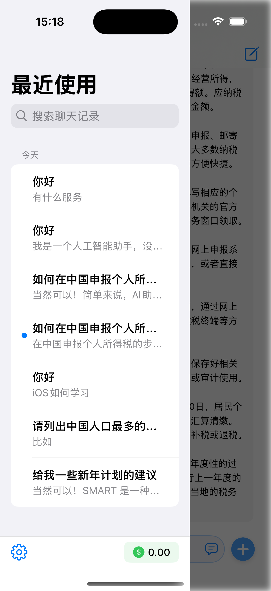
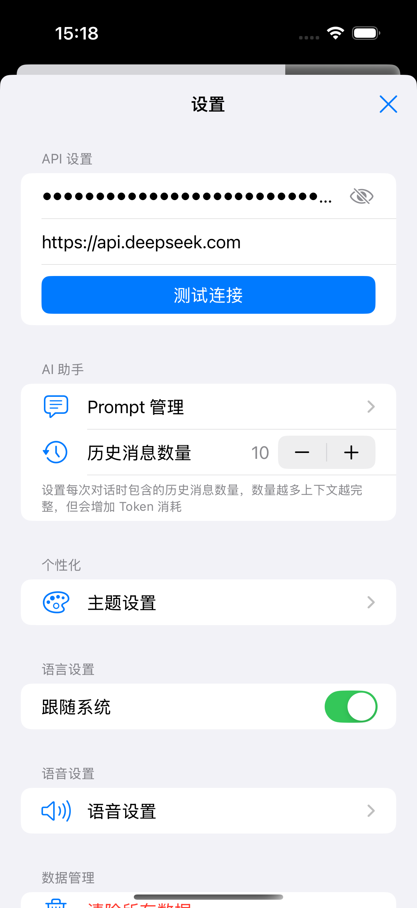
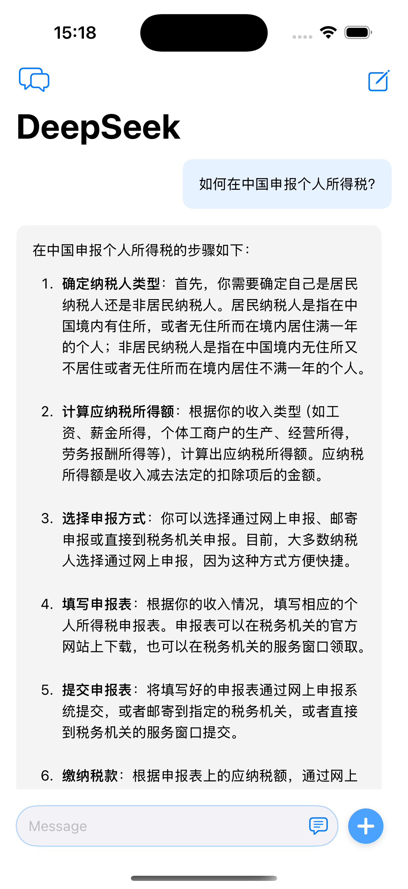
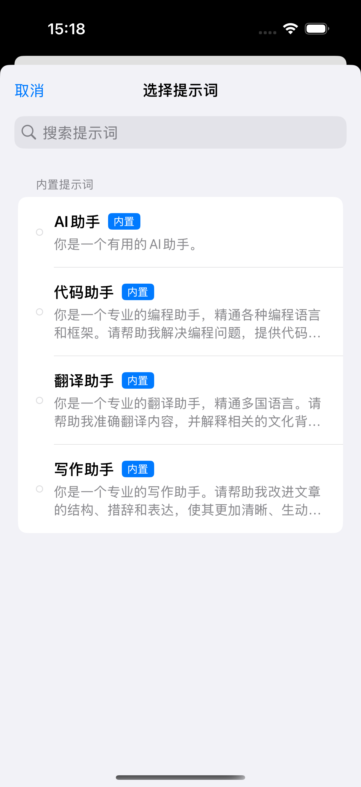
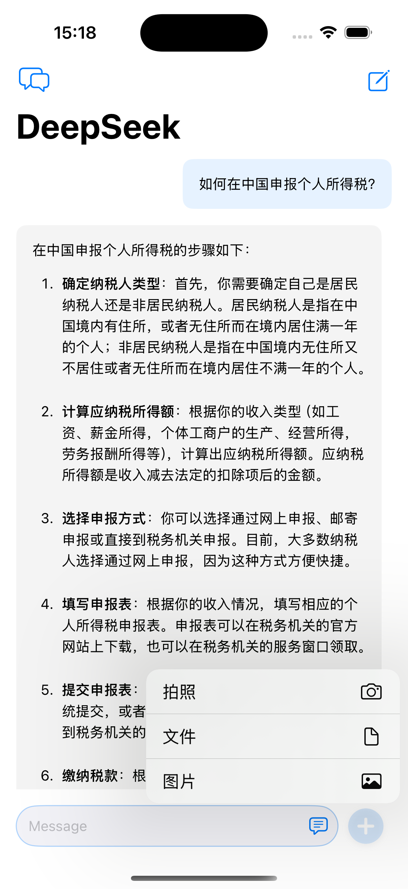

# DeepSeek iOS 客户端

基于 SwiftUI 开发的 DeepSeek API 移动端 AI 应用。通过 DeepSeek 强大的大语言模型能力,为用户提供流畅的 AI 对话体验。支持实时对话、多轮交互、历史记录管理、自定义提示词等功能,让您随时随地享受智能对话服务。

## 应用截图

<div style="display: flex; flex-wrap: wrap; gap: 10px; justify-content: center;">
    
    
    
    
    
    
</div>

## 功能特性

### 核心功能

- 实时 AI 对话：与 DeepSeek AI 进行实时对话交互
- 历史会话管理：保存并管理所有对话历史
- 多主题支持：支持多种对话场景和主题
- 消息本地存储：使用 CoreData 实现消息持久化
- 自定义设置：个性化配置对话参数

### 特色功能

- 快捷提示词：预设常用提示词，快速开始对话
- 消息复制：支持复制对话内容
- 实时输入：流畅的打字体验和即时响应
- 优雅的 UI：符合 iOS 设计规范的界面设计

## 技术架构

- SwiftUI
- CoreData (本地存储)
- DeepSeek API

## 项目结构

```DeepSeek/
├── Core/
│ ├── Network/ # 网络请求、API封装
│ ├── Services/ # 核心服务
│ └── Storage/ # 数据存储相关
├── Data/
│ ├── Models/ # 数据模型定义
│ └── Stores/ # 状态管理
├── Features/
│ ├── Chat/ # 聊天功能
│ │ ├── Views/ # 聊天界面
│ │ ├── Models/ # 聊天数据模型
│ │ └── ViewModels/ # 聊天业务逻辑
│ ├── Setting/ # 设置功能
│ │ ├── Views/ # 设置界面
│ │ └── ViewModels/ # 设置业务逻辑
│ ├── Prompt/ # 提示词管理
│ │ ├── Views/ # 提示词界面
│ │ └── Models/ # 提示词数据模型
│ └── Components/ # 公共组件
├── Resources/ # 资源文件
│ ├── Assets/ # 图片资源
│ └── Localization/ # 多语言
└── Utils/ # 工具类
    ├── Extensions/ # 扩展
    └── Helpers/ # 辅助工具
```

## 开发进度

- [x] 基础 UI 框架
- [x] 聊天界面
- [x] 侧边栏导航
- [x] API 集成
- [x] 数据持久化
- [x] 设置功能
- [x] 错误处理

## 开发环境

- Xcode 15+
- iOS 17.0+
- Swift 5.9+
